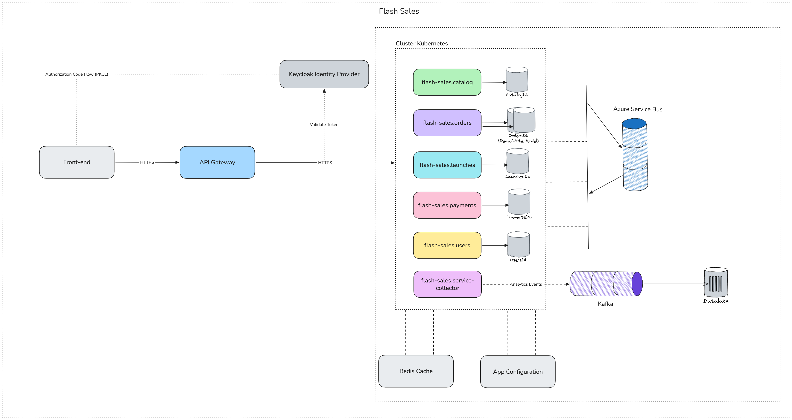

# Flash Sales

Flash Sales is a microservices platform for running high-demand, time-boxed product launches, where a hard-limited stock has to be sold fairly and correctly under a burst of concurrent buyers. It is built as a reference architecture for distributed .NET systems: every pattern documented below is wired end-to-end and running, not sketched — this repository is meant to be read as a working example, not a proposal.

## Highlights

- **Keycloak-backed identity**, with permission-based authorization resolved over gRPC and cached in Redis, plus two distinct OAuth2 flows (client-credentials and On-Behalf-Of token exchange) chosen per call.
- **Event-sourced `Order` aggregate** on Marten, with CQRS read projections materialized into MongoDB — the write model is an immutable event stream, the read model is purpose-built for queries.
- **Transactional Outbox and Inbox** in every module, backed by Azure Service Bus, with idempotency baked into the mediator pipeline instead of hand-rolled per handler.
- **Orchestrated saga** driving order creation across Launches and Payments, with explicit compensation and two independent sweep jobs as a safety net.
- **Stripe payment gateway** integration behind a swappable abstraction.
- **Feature flags and dynamic configuration** via Azure App Configuration.
- **Clickstream analytics pipeline**: a dedicated service collector ingests front-end interaction events, streams them through Kafka, and lands them in a Data Lake for product analytics.
- **Secrets in Azure Key Vault** — no connection strings or client secrets sitting in plaintext configuration.
- **Full distributed tracing and structured logging** via OpenTelemetry and Serilog, exported to Jaeger and Seq, correlated across HTTP and background-job execution alike.
- **gRPC** for synchronous cross-service calls, with the standard gRPC Health Checking Protocol exposed alongside REST health checks.
- **API Gateway** fronting all five services, with a Kubernetes deployment topology behind it.
- **Composable, per-service infrastructure**: no service inherits infrastructure it doesn't use — every cross-cutting concern (cache, blob storage, messaging, health checks) is opted into explicitly, module by module.

## Architecture



A front-end authenticates against **Keycloak** via Authorization Code Flow with PKCE, then talks to the platform through an **API Gateway**, which routes to a Kubernetes-hosted cluster of five bounded-context services plus the analytics service collector. Every request carries a Keycloak-issued JWT, validated independently by the service handling it — the gateway routes, it does not authorize. Services communicate synchronously over **gRPC** and resilient HTTP, and asynchronously over **Azure Service Bus** through a per-module Outbox/Inbox pipeline. Orders' data is split across a write model (the Marten event stream) and a read model (MongoDB projections), exactly as drawn in the diagram.

## Bounded Contexts

| Service | Responsibility | Persistence | Notable role |
|---|---|---|---|
| `flash-sales.catalog` | Products, sellers, product images | PostgreSQL (write) + Dapper (read) | Public API consumed by other modules; owns product images in Blob Storage |
| `flash-sales.launches` | Launch lifecycle, stock reservation/release | PostgreSQL (write) + Dapper (read) | Scheduled jobs activate and end launches automatically |
| `flash-sales.orders` | Order creation, confirmation, cancellation, refund | Marten event stream (write) + MongoDB projections (read) | Orchestrates the order-creation saga across Launches and Payments |
| `flash-sales.payments` | Payment checkout, reconciliation | PostgreSQL | Integrates with Stripe as the payment gateway |
| `flash-sales.users` | Identity, permissions, seller onboarding | PostgreSQL (write) + Dapper (read) | Hosts the gRPC permissions server every other service consumes; owns Keycloak admin integration |
| `flash-sales.service-collector` | Clickstream / interaction event ingestion | Kafka → Data Lake | Decoupled from the transactional path entirely; feeds product analytics |

All six sit on a shared `FlashSales.Infrastructure` / `FlashSales.Application` / `FlashSales.Endpoints` building-blocks layer, plus per-module `Domain` / `Application` / `Infrastructure` / `Endpoints` / `Contracts` projects that keep each context's public contract isolated from its internals.

## Identity & Authorization

Keycloak is the identity provider for the whole platform: JWT bearer authentication, Authorization Code Flow with PKCE for the front-end, and client-credentials for service-to-service calls. A custom claims transformation gates permission population behind an `activated` realm role, so an unactivated account never receives a populated permission set — most authorization checks fail closed with zero special-casing. A dedicated activation middleware closes the remaining gap, rejecting any authenticated request to an endpoint that doesn't require a specific permission with a structured `403 account_not_activated` response until the account is activated.

Authorization itself is fine-grained and permission-based, resolved over **gRPC** from the Users service and cached per module in Redis rather than trusted from claims baked into the token. Outbound service calls pick between two OAuth2 flows depending on what they need: client-credentials for calls with a fixed, statically-mapped audience, and RFC 8693 On-Behalf-Of token exchange when a downstream call has to carry the original user's identity forward — for example, Orders calling Payments on the caller's behalf. A caller-identity logging middleware distinguishes real end-users from service-account callers by Keycloak's `preferred_username: service-account-<clientId>` convention, so every log line is attributed to the right kind of caller.

## Event Sourcing & CQRS (Orders)

The `Order` aggregate is event-sourced on **Marten**: every state transition — creation, payment processing, confirmation, cancellation, refund — is captured as an immutable event on the aggregate's stream instead of being persisted as mutable row state. The aggregate rebuilds itself from its own event history, and the same domain events that drive the aggregate feed the Outbox pipeline, so there's a single source of truth for "what happened," not two parallel event models.

The read side is a proper **CQRS split**: queries against Orders are served from denormalized projections materialized into **MongoDB**, purpose-built for the access patterns the API actually needs, instead of querying the write-optimized event stream directly. The order-creation saga, Outbox, and Inbox stay on EF Core/PostgreSQL exactly as in every other module — only the `Order` aggregate itself moved, which keeps the migration's blast radius contained to where event sourcing actually pays off.

## Messaging Reliability — Outbox / Inbox

Every module implements the transactional **Outbox pattern**: domain events raised inside a request are written to an outbox table in the same database transaction as the business change, then asynchronously drained and published to **Azure Service Bus** by a background processor — no dual-write, no lost events on a mid-request crash. Symmetrically, every module implements the **Inbox pattern** to consume integration events from other bounded contexts idempotently, deduplicating via a consumer ledger so a redelivered Service Bus message is a no-op, not a double-apply. Both patterns are generic, reusable building blocks parameterized per module by schema and subscribed topics, paired with dedicated pipeline behaviors in the mediator so individual handlers never have to hand-roll idempotency.

## Orchestrated Saga

Order creation is coordinated by an explicit **orchestrated saga**, not a choreography of independent event handlers reacting blindly to each other: reserve stock in Launches, checkout in Payments, then confirm the order — with **compensating actions** (stock release, order cancellation) triggered automatically on any step's failure. Two independent sweep jobs act as a safety net on top of the saga's own bookkeeping: one reconciles sagas that go stale mid-flight, the other expires orders whose payment window has lapsed regardless of what state the saga thinks it's in.

## Payment Gateway

Payment checkout integrates with **Stripe** behind a swappable gateway abstraction, so the gateway can change without touching payments domain logic. A reconciliation job runs on a schedule to reconcile gateway-reported state against local records, catching drift from webhooks that never arrived or were processed out of order.

## Feature Flags & Configuration

Runtime feature flags and dynamic configuration are served from **Azure App Configuration**, enabling gradual rollouts and kill switches without a redeploy. Configuration changes propagate to running services without requiring a restart, keeping flag flips genuinely operational rather than deployment events.

## Secrets Management

Connection strings, client secrets, and API keys are never held in plaintext configuration — they're resolved from **Azure Key Vault** at startup, per environment, with the local Docker Compose stack standing in for it during development.

## Analytics Pipeline

The `flash-sales.service-collector` service is intentionally decoupled from the transactional path: it ingests front-end click and interaction events, publishes them onto **Kafka**, and Kafka feeds a **Data Lake** for downstream product analytics. Nothing about checkout, stock, or payments depends on this pipeline being healthy — analytics failure never becomes a sales-path incident.

## Observability — Tracing, Logging, Health Checks

Distributed tracing runs on **OpenTelemetry**, instrumenting ASP.NET Core, HttpClient, gRPC clients, EF Core, and Redis, exported over OTLP to both **Jaeger** and **Seq**'s native OTLP ingestion — every request is traceable across service boundaries by a single `TraceId`, gRPC hops included. Structured logging runs on **Serilog**, enriched with machine name, thread id, environment, and — critically — span correlation, so every log line carries the current trace's `TraceId`/`SpanId` in both HTTP request context and background-job execution, not just the request path.

Health checks are granular and per-service by design: each service exposes a live/ready split (`/health/live`, `/health/ready`) reporting only on the dependencies it actually opted into — Postgres, Redis, Service Bus, OIDC metadata, Blob Storage, downstream gRPC availability — instead of every service reporting on infrastructure it never touches.

## Inter-Service Communication

**gRPC** carries synchronous cross-service calls: Users hosts a permissions gRPC server exposing the standard gRPC Health Checking Protocol, and every other service is an authenticated gRPC client with its own gRPC-availability health check. Saga steps that need a synchronous round trip use resilient typed HTTP clients with timeout, retry, and circuit-breaker policies per downstream dependency. Everything else — cross-context propagation that doesn't need an immediate answer — flows asynchronously as integration events over **Azure Service Bus** through the Outbox/Inbox pipeline.

## Storage

PostgreSQL is scoped one schema per module, written through EF Core and read through Dapper riding the same connection EF Core already opened — no second connection pool, no drift between the write and read paths for the modules that stay relational. Redis backs cross-module permission caching as a shared, opt-in building block. Azure Blob Storage holds product images and seller profile pictures. Orders is the exception by design: its write model lives in Marten's event store and its read model in MongoDB, per the [Event Sourcing & CQRS](#event-sourcing--cqrs-orders) section above.

## Composable Infrastructure Building Blocks

A deliberate departure from the assumption — valid in the original modular monolith, wrong for independently deployable services — that every module needs identical infrastructure. A minimal core wires only what's truly universal: the mediator pipeline, authentication/authorization, exception handling, and baseline health checks. Cache, Blob Storage, and Service Bus are independent, explicitly opt-in building blocks that each module's own composition root calls only for what it uses — Blob Storage is wired for Catalog and Users and nowhere else, for instance. This keeps each service's dependency graph, and its health-check surface, an honest reflection of what it actually needs, and lets any module opt out of a concern independently without touching shared code — which is exactly what let Orders adopt an entirely different persistence model for its aggregate without forking the shared infrastructure layer.

## API Gateway & Deployment

A single **API Gateway** fronts all five services, terminating TLS and doing coarse-grained routing while leaving fine-grained authorization to each service — the gateway is a routing and edge concern, not a second authorization layer, so no service trusts a request just because it arrived through the gateway. The platform runs on **Kubernetes**, one deployment per bounded-context service plus the service collector, matching the cluster topology in the architecture diagram above.

## Local Development

The full local dependency stack is defined in [`docker/docker-compose.yml`](docker/docker-compose.yml):

| Service | Purpose |
|---|---|
| `keycloak` (+ `keycloak-postgres`) | Identity provider, realm auto-imported on start |
| `flash-sales-postgres` | Shared PostgreSQL instance, one schema per relational module |
| `redis` | Permission cache |
| `seq` | Structured log sink + OTLP trace ingestion |
| `jaeger` | Distributed trace visualization |
| `azurite` | Local Azure Blob Storage emulator |
| `servicebus-emulator` (+ `servicebus-mssql`) | Local Azure Service Bus emulator |
| `app-configuration` | Azure App Configuration emulator — feature flags and dynamic config |
| `kafka` | Event streaming backbone for the service collector |
| `mongodb` | Orders CQRS read projections |

```bash
docker compose -f docker/docker-compose.yml up -d
```

Then run any service from `src/Apps/APIs/FlashSales.<Name>.Api` — each is a standalone `dotnet run`-able ASP.NET Core project pointed at the shared local stack via `appsettings.Development.json`.

## Tech Stack

| Concern | Technology |
|---|---|
| Runtime | .NET 10, ASP.NET Core Minimal APIs |
| Write-model persistence | Entity Framework Core (Npgsql), Marten (event sourcing — Orders) |
| Read-model persistence | Dapper, MongoDB (Orders projections) |
| Mediator / pipeline | MidR (commands, queries, notifications, pipeline behaviors) |
| Validation | FluentValidation |
| Messaging | Azure Service Bus, Kafka |
| Cache | Redis (StackExchange.Redis) |
| Identity | Keycloak (OIDC, JWT Bearer) |
| Inter-service RPC | gRPC (`Grpc.AspNetCore`) |
| Object storage | Azure Blob Storage (Azurite locally) |
| Secrets | Azure Key Vault |
| Feature flags / config | Azure App Configuration |
| Payments | Stripe |
| Logging | Serilog → Seq |
| Tracing | OpenTelemetry → Jaeger / Seq (OTLP) |
| Health checks | `Microsoft.Extensions.Diagnostics.HealthChecks` + community packages |
| Edge | API Gateway |
| Deployment | Kubernetes |
| Local orchestration | Docker Compose |
